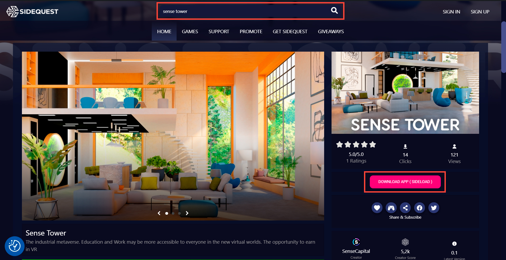
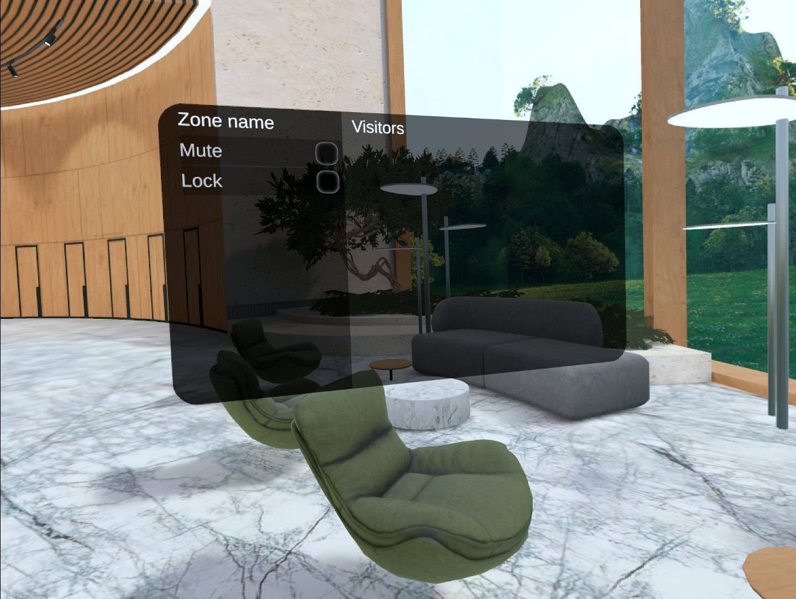
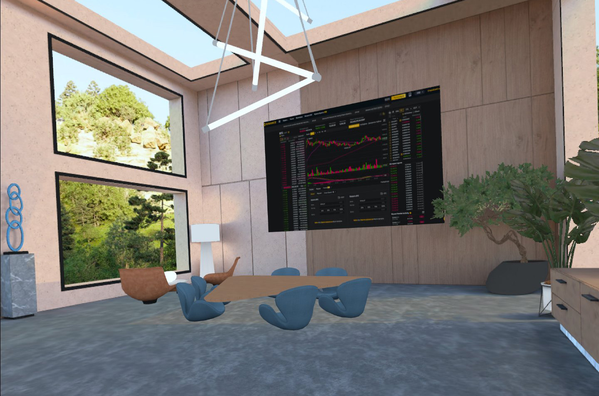
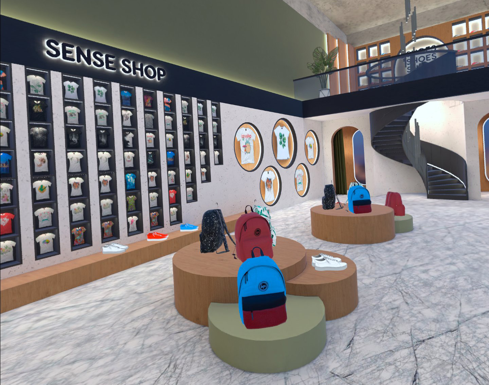

# ПОЛЬЗОВАТЕЛЬСКАЯ ДОКУМЕНТАЦИЯ 

## ОБЩЕЕ ОПИСАНИЕ 

Приложение SenseTower – это многопользовательское пространство в виртуальной реальности для проведения встреч, мероприятий и совместной работы. SenseTower позволяет пользователям со всего мира при наличии очков виртуальной реальности собираться в едином виртуальном пространстве для личных, деловых, корпоративных, образовательных или общественных встреч, а в ближайшем будущем также позволит приобретать, пользоваться или обмениваться уникальными виртуальными криптографическими объектами. 

SenseTower дает человеку возможность создать свою виртуальную копию, свободно перемещаться по всем локациям и пользоваться их различным функционалом, взаимодействовать с другими пользователями, выступать, отдыхать, создать свое личное виртуальное пространство, изменять и украшать его. 

## МИНИМАЛЬНЫЕ ТЕХНИЧЕСКИЕ ТРЕБОВАНИЯ 

При запуске приложения с мобильной VR-гарнитуры рекомендуется использоваться Oculus Quest 2

При запуске приложения с ПК, рекомендуется использовать ПК со следующими техническими характеристиками: 

Процессор Intel i5/AMD Ryzen 5 или мощнее

Оперативная память 8 Гб и более

Операционная система Windows 10

Видеокарта NVIDIA GEFORCE GTX 970/AMD 400 или мощнее

Наличие USB порта

## УСТАНОВКА 

В данный момент есть несколько способов воспользоваться приложением SenseTower на VR-гарнитуре Oculus Quest 2

### I. Установить с помощью SideQuest

(На шлеме должен быть включен режим разработчика) 

1. Скачать программу SideQuest на свой ПК по ссылке <https://sidequestvr.com/setup-howto>

2. Установить программу SideQuest на свой ПК

3. Открыть программу SideQuest

4. Подключить шлем к ПК через USB шнур

5. В поле поиска программы SideQuest ввести Sense Tower и нажать Enter 

6. Кликнуть на первое окно в результатах поиска 

7. Нажать кнопку Download App (Sideload) 

8. Приложение можно найти и запустить по следующему пути: Приложения — В верхнем правом углу меняем «Все» на «Неизвестные источники» — SenseTower

### II. Установить с помощью консоли

(На шлеме должен быть включен режим разработчика) 

1. Скачать SDK Platform-Tools for Windows на свой ПК по ссылке <https://developer.android.com/studio/releases/platform-tools>

2. Разархивировать папку platform-tools

3. Скачать установочный файл apk на свой ПК с помощью запроса через связь с разработчиками на сайте <https://sensetower.io/>

4. Подключить шлем к ПК через USB шнур

5. Открыть папку platform-tools

6. Ввести в строке адреса папки cmd для вызова консоли

7. В появившейся консоли ввести: adb install (путь к скачанному apk) и нажать Enter

8. Разрешить в шлеме вносить изменения

9. Приложение можно найти и запустить по следующему пути: Приложения — В верхнем правом углу меняем «Все» на «Неизвестные источники» — SenseTower

## РЕГИСТРАЦИЯ 

Для наиболее удобного использования приложения SenseTower в нем необходимо зарегистрироваться. 

Чтобы зарегистрироваться в приложении SenseTower нужно открыть приложение на Вашей VR-гарнитуре и в первой сцене в специально отведенном для авторизации окне нажать кнопку «Зарегистрироваться». После этого откроется окно в браузере, в котором нужно будет ввести код приглашения, имя (которое будет отображаться в приложении для других игроков), адрес электронной почты, пароль и индентификатор своего криптокошелька. 

Код приглашения можно получить у своих знакомых, которые ранее зарегистрировались и подтвердили свою почту, или же получить его самостоятельно, обратившись в компанию напрямую на сайте <https://sensetower.io/>. Если после регистрации в приложении Вы найдете письмо от SenseTower у себя на почте и подтвердите, что это Ваша почта, то тоже получите пять кодов приглашений и сможете отравить их своим друзьям. 

Пароль для регистрации в приложении в целях Вашей безопасности должен содержать минимум двенадцать символов, из которых минимум один должен быть специальным знаком, минимум один должен быть цифрой, минимум один должен быть заглавной буквой латинского алфавита и минимум один должен быть строчной буквой латинского алфавита. 

После заполнения всех полей нужно нажать кнопку Create, вернуться в приложение, ввести там в окне авторизации имя и пароль и нажать кнопку «Войти». 

## ОПИСАНИЕ ЛОКАЦИЙ 

Виртуальное пространство SenseTower разделено на несколько локаций, каждая из которых подходит для определенных функций. 

#### Лобби

После авторизации в приложении пользователь попадает на локацию Лобби (Ресепшн). В Лобби как и везде можно свободно перемещаться, общаться, садиться на диваны и кресла, а в ближайшем будущем можно будет и узнать о возможностях пространства, о том, какие общедоступные мероприятия и встречи сейчас проходят. 

Перемещаться по Лобби и всем другим сценам можно с помощью телепорта. Для того, чтобы переместиться из одной точки в другую достаточно навести луч телепорта, исходящий из руки, на ту точку в пространстве, куда Вы хотите попасть, и нажать на любом контроллере кнопку перемещения, т.е. подвинуть Стик вперед (Стик это кнопка в виде рычажка под большим пальцем на контроллере). 

Лобби состоит из двух этажей, перемещение между которыми происходит с помощью лифта. Чтобы воспользоваться лифтом и попасть на другой этаж нужно подойти к двери лифта, направить на нее луч телепорта из руки и нажать на кнопку перемещения.

Также Лобби содержит в себе специальные зоны для переговоров. Если подойти к любому сидячему месту и навести на него луч телепорта, то специальными знаками посдвечиваются все незанятые сидячие места, входящие в одну зону для переговоров. Знак над местом, выбранным Вами, подсвечивается другим цветом. Занять сидячее место можно тем же путем, что и происходит обычное перемещение - навести луч телепорта на сидячее место и нажать на кнопку перемещения. 

Расположившись первым в зоне для переговоров Вы становитесь ее администратором и получаете права администрирования зоны. Все кто заходит после Вас становятся гостями зоны и не имеют тех же прав. Если Вы выйдете из зоны, когда там есть другие пользователи, то роль администартора зоны передается пользователю, который зашел в зону после Вас. Соответственно если Вы заходите в зону, в которой уже есть пользователи, то Вы становитесь гостем и получаете права администрирования зоны только после того, как из зоны выйдут все участники, которые зашли туда до Вас. 

Как администратор зоны для переговоров Вы можете управлять ею с помощью специального меню, которое появляется в зоне для переговоров как только вы становитесь ее администратором. Это меню видит только администратор, другие гости переговорной зоны или пользователи на сцене вокруг не могут видеть меню админситрирования переговорной зоны. В правой части меню находится список всех гостей, находящихся в зоне, а также специальные кнопки для взаимодействия с гостями. Кнопка "admin" напротив имени гостя позволяет сделать любого гостя администратором зоны вместо Вас. Тогда Вы теряете полномочия администратора и перестаете видеть данное меню, а выбранный Вами пользователь увидит меню и сможет управлять зоной. Кнопка "kick" у имени гостя же, напротив, позволит убрать данного гостя из Вашей зоны. При нажатии на эту кнопку аватар этого гостя автоматически телепортируется из переговорной зоны и его имя пропадет из списка гостей зоны. 

С левой стороны меню администрирования зоны для переговоров Вы можете управлять не отдельными гостями, а всей зоной сразу. Если Вы поставите галочку напротив команды Mute, то все пользователи сцены, находящиеся вокруг Вас, но не в Вашей зоне для переговоров, перестанут слышать все, о чем Вы говорите со своими гостями в зоне. Так же и Вы перестанете слышать всех, кто находится вне Вашей переговорной зоны. Чтобы опять начать слышать людей вокруг Вас и чтобы они начали слышать Вас и гостей в Вашей зоне необходимо просто убрать галочку напротив слова Mute.

Из Лобби осуществляется переход на все другие доступные локации максимально реалистичным способом — нужно найти в Лобби дверь в нужную локацию и зайти в нее, направив на дверь луч телепорта из руки и нажав на кнопку перемещения. В данный момент из Лобби можно попасть в Лекторий, Кинотеатр, Комнату для выступлений (Стендап), Комнату для переговоров, Магазин и в свои личные Апартаменты. 

#### Апартаменты

Апартаменты представляют собой личное виртуальное помещение пользователя. В нем возможно находиться одному и принимать посетителей. А в ближайшем будущем можно будет изменять и обустраивать его по собственному желанию. 

Апартаменты также состоят из двух этажей. На первом этаже располагается неформальная зона, а на втором деловая. Для того, чтобы перемещаться между этажами, нужно направить на лестницу луч телепорта и нажать на кнопку перемещения. 

#### Лекторий

Лекторий выполняет все базовые задачи помещения для выступления перед аудиторией. 

В скором времени можно будет самостоятельно менять дизайн помещения, что позволит являться слушателями одновременно неограниченному количеству человек.

#### Кинотеатр

Кинотеатр представляет собой также потенциально неограниченное виртуальное помещение, в котором можно будет совместно просматривать фильмы или другие видео-материалы на большом экране, разместившись в уютных виртуальных креслах.

#### Стендап

Локация Стендап дает возможность выступления одному человеку перед аудиторией в неформальной обстановке. 

#### Комната для переговоров 

Комната для переговоров позволит создать наиболее подходящую атмосферу для деловых встреч и в ближайшем будущем приобретет для этого все необходимые инструменты. 

#### Магазин 

Совсем скоро наш виртуальный магазин заработает в полной мере и в нем можно будет приобретать различные товары для уникализации своих аватаров и помещений. 

