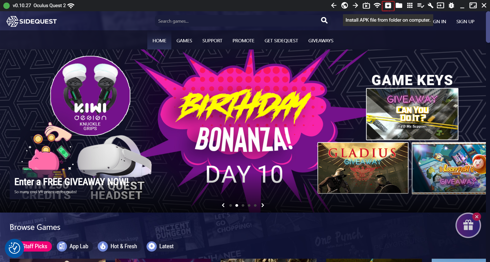
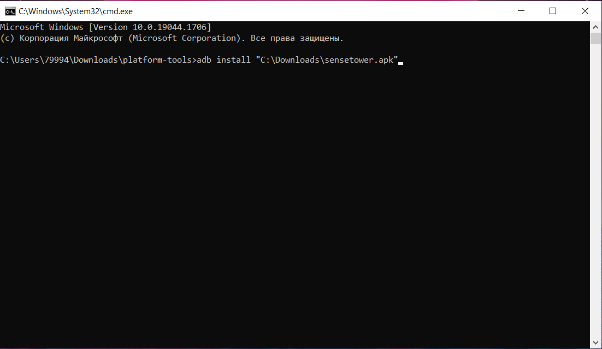
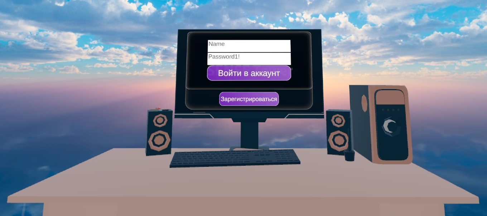
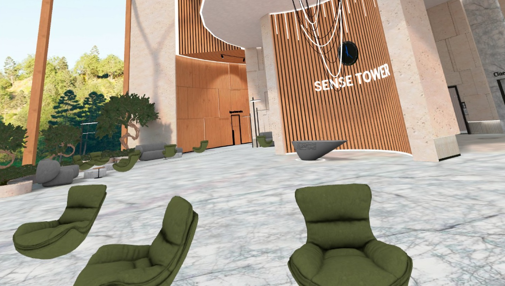
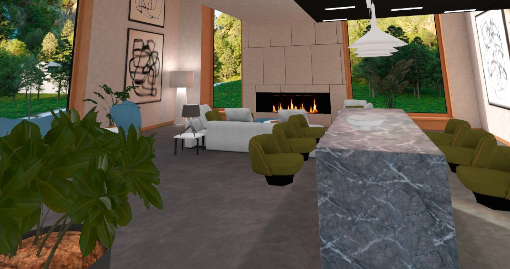
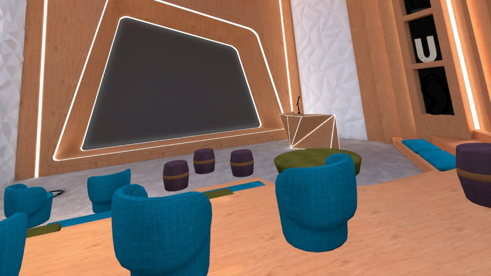
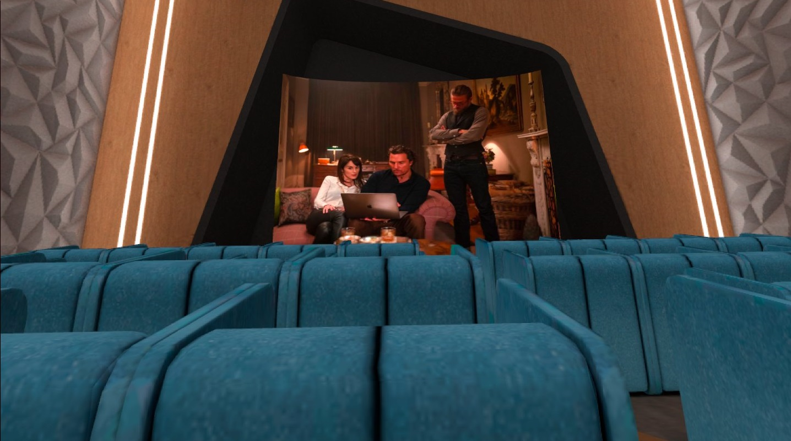
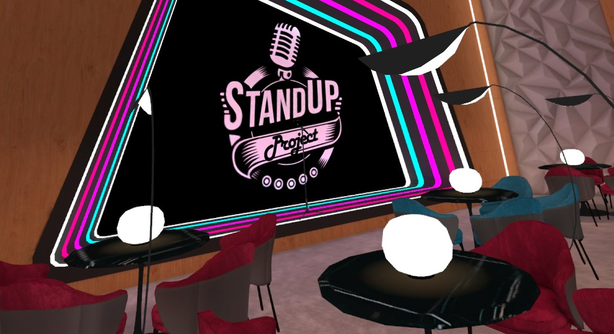

# ПОЛЬЗОВАТЕЛЬСКАЯ ДОКУМЕНТАЦИЯ 

## ОБЩЕЕ ОПИСАНИЕ 

Приложение SenseTower – это многопользовательское пространство в виртуальной реальности для проведения встреч, мероприятий и совместной работы. SenseTower позволяет пользователям со всего мира при наличии очков виртуальной реальности собираться в едином виртуальном пространстве для личных, деловых, корпоративных, образовательных или общественных встреч, а также приобретать, пользоваться или обмениваться уникальными виртуальными криптографическими объектами. 

SenseTower дает человеку возможность создать свою виртуальную копию, свободно перемещаться по всем локациям и пользоваться их различным функционалом, взаимодействовать с другими пользователями, выступать, отдыхать, создать свое личное виртуальное пространство, изменять и украшать его. 

## МИНИМАЛЬНЫЕ ТЕХНИЧЕСКИЕ ТРЕБОВАНИЯ 

При запуске приложения с мобильной VR-гарнитуры рекомендуется использоваться Oculus Quest 2

При запуске приложения с ПК, рекомендуется использовать ПК со следующими техническими характеристиками: 

Процессор Intel i5/AMD Ryzen 5 или мощнее

Оперативная память 8 Гб и более

Операционная система Windows 10

Видеокарта NVIDIA GEFORCE GTX 970/AMD 400 или мощнее

Наличие USB порта

## УСТАНОВКА 

В данный момент есть несколько способов воспользоваться приложением SenseTower на VR-гарнитуре Oculus Quest 2

### I. (В работе) Скачать из официального магазина Oculus

1. Надеть шлем, найти приложение Магазин (Store), открыть его

2. В строке поиска ввести SenseTower

3. Выбрать нужное приложение в результатах выдачи и кликнуть на него

4. Нажать кнопку «Получить»

5. Дождаться окончания загрузки

6. Приложение можно найти и запустить среди остальных установленных приложений в меню Приложения

### II. Установить с помощью SideQuest

(На шлеме должен быть включен режим разработчика) 

1. Скачать программу SideQuest на свой ПК по ссылке <https://sidequestvr.com/setup-howto>

2. Установить программу SideQuest на свой ПК

3. Скачать установочный файл apk на свой ПК с помощью запроса через связь с разработчиками на сайте <https://sensetower.io/>

4. Подключить шлем к ПК через USB шнур

5. Открыть программу SideQuest

6. В верхнем меню программы выбрать иконку Install APK file from folder on computer

7. Выбрать в проводнике скачанный установочный apk

8. Разрешить в шлеме вносить изменения

9. Приложение можно найти и запустить по следующему пути: Приложения — В верхнем правом углу меняем «Все» на «Неизвестные источники» — SenseTower

### III. Установить с помощью консоли

(На шлеме должен быть включен режим разработчика) 

1. Скачать SDK Platform-Tools for Windows на свой ПК по ссылке <https://developer.android.com/studio/releases/platform-tools>

2. Разархивировать папку platform-tools

3. Скачать установочный файл apk на свой ПК с помощью запроса через связь с разработчиками на сайте <https://sensetower.io/>

4. Подключить шлем к ПК через USB шнур

5. Открыть папку platform-tools

6. Ввести в строке адреса папки cmd для вызова консоли

7. В появившейся консоли ввести: adb install (путь к скачанному apk) и нажать Enter

8. Разрешить в шлеме вносить изменения

9. Приложение можно найти и запустить по следующему пути: Приложения — В верхнем правом углу меняем «Все» на «Неизвестные источники» — SenseTower

## РЕГИСТРАЦИЯ 

Для наиболее удобного использования приложения SenseTower в нем необходимо зарегистрироваться. 

Чтобы зарегистрироваться в приложении SenseTower нужно открыть приложение на Вашей VR-гарнитуре и в первой сцене в специально отведенном для авторизации окне нажать кнопку «Зарегистрироваться». После этого нужно дать разрешение для использования браузера, в котором нужно будет ввести имя (которое будет отображаться в приложении для других игроков), адрес электронной почты и пароль. Пароль должен содержать минимум шесть символов, из которых минимум один должен быть специальным знаком, минимум один должен быть цифрой, минимум один должен быть заглавной буквой латинского алфавита и минимум один должен быть строчной буквой латинского алфавита. После этого нужно нажать кнопку Create, вернуться в приложение и ввести там в окне авторизации имя и пароль. 

Регистрация необходима только один раз, далее Ваши имя и пароль сохраняются в окне авторизации и для быстрого входа нужно будет нажать только кнопку «Войти». 

## ОПИСАНИЕ ЛОКАЦИЙ 

Виртуальное пространство SenseTower разделено на несколько локаций, каждая из которых подходит для определенных функций. 

#### Лобби

После авторизации в приложении пользователь попадает на локацию Лобби (Ресепшн). В Лобби как и везде можно свободно перемещаться, общаться, садиться на диваны и кресла, а также узнать о возможностях пространства и о том, какие общедоступные мероприятия и встречи сейчас проходят. 

Перемещаться по Лобби и всем другим сценам можно с помощью телепорта. Для того, чтобы переместиться из одной точки в другую достаточно навести луч телепорта, исходящий из руки, на ту точку в пространстве, куда Вы хотите попасть, и нажать на любом контроллере кнопку перемещения, т.е. подвинуть Стик вперед (Стик это кнопка в виде рычажка под большим пальцем на контроллере). 

Лобби состоит из двух этажей, перемещение между которыми происходит с помощью лифта. Чтобы воспользоваться лифтом и попасть на другой этаж нужно подойти к двери лифта, направить на нее луч телепорта из руки и нажать на кнопку перемещения.

Также Лобби содержит в себе специальные зоны для переговоров. Подойдя к любому сидячему месту и наведя на него луч телепорта специальными знаками посдвечиваются все незанятые сидячие места, входящие в одну зону для переговоров. Знак над местом, выбранным Вами, подсвечивается другим цветом. Занять сидячее место можно тем же путем, что и происходит обычное перемещение - навести луч телепорта на сидячее место и нажать на кнопку перемещения. Расположившись первым в зоне для переговоров Вы становитесь ее администратором и получаете права администрирования зоны. Все кто заходит после Вас становятся гостями зоны и не имеют тех же прав. Если Вы выйдете из зоны, когда там есть другие пользователи, то роль администартора зоны передается пользователю, который зашел в зону после Вас. Соответственно если Вы заходите в зону, в которой уже есть пользователи, то Вы становитесь гостем и получаете права администрирования зоны только после того, как из зоны выйдут все участники, которые зашли туда до Вас. Для понимания ролей участников зоны переговоров в центре зоны находится специальный планшет, на котором написано сколько человек находится в зоне, их роли и имена. Если экран планшета зеленого цвета, то зона свободна и в ней никого нет, а если желтого, то зона занята. Планшет можно брать в руку, поворачивать и перемещать. Для того, чтобы взять планшет, необходимо навести на него луч указателя из руки и зажать кнопку захвата (это кнопка под средним пальцем на контроллере). Чтобы отпустить планшет, нужно отжать кнопку захвата. 

Из Лобби осуществляется переход на все другие доступные локации максимально реалистичным способом — нужно найти в Лобби дверь в нужную локацию и зайти в нее, направив на дверь луч телепорта из руки и нажав на кнопку перемещения. В данный момент из Лобби можно попасть в Апартаменты, Лекторий, Кинотеатр и Комнату для выступлений (Стендап). 

#### Апартаменты

Апартаменты представляют собой личное виртуальное помещение пользователя. В нем возможно находиться одному, принимать посетителей, изменять и обустраивать его по собственному желанию. 

Апартаменты также состоят из двух этажей. На первом этаже располагается неформальная зона, а на втором деловая. Для того, чтобы перемещаться между этажами, нужно направить на лестницу луч телепорта и нажать на кнопку перемещения. 

#### Лекторий

Лекторий выполняет все базовые задачи помещения для выступления перед аудиторией. Дизайн помещения можно менять и одновременно являться слушателями может неограниченное количество человек — как во время нахождения в VR с помощью шлема, так и воспользовавшись десктопным приложением на ПК при отсутствии VR-гарнитуры. В лектории присутствуют экран для презентаций с возможностью вывода изображения с ПК выступающего и классическая маркерная доска. 

#### Кинотеатр

Кинотеатр представляет собой также потенциально неограниченное виртуальное помещение, в котором можно совместно просматривать фильмы или другие видео-материалы на большом экране, разместившись в уютных виртуальных креслах.

#### Стендап

Локация Стендап дает возможность выступления одному человеку перед аудиторией в неформальной обстановке. 

#### Комната для переговоров 

Комната для переговоров имеет все необходимые инструменты для проведения бизнес встреч. Ее дизайн можно также менять, включая и объекты интерьера, и размеры стола, и количество стульев для присутствующих на встрече. На локации присутствует классическая маркерная доска и возможность проводить презентации со своего ПК на большом экране в VR. Чтобы подключится к переговорам также необязательно использовать VR-гарнитуру, а можно воспользоваться десктопным приложением. 

